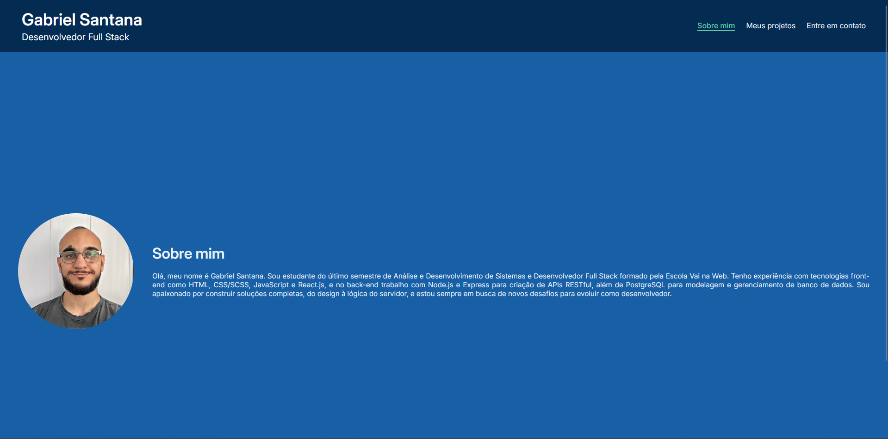

# 💼 Portfólio - Gabriel Santana

Projeto de portfólio desenvolvido com React + Vite para apresentação profissional, exibição de projetos e formulário de contato funcional.

---

## 📸 Preview



---

## 🚀 Tecnologias utilizadas

- React.js
- Vite
- JavaScript
- SCSS Modules
- React Router DOM
- EmailJS

---

## 🎯 Funcionalidades

- Navegação entre páginas com React Router
- Layout totalmente responsivo
- Menu hamburger para dispositivos móveis
- Página de apresentação pessoal
- Seção de projetos contendo links para deploy e repositório
- Formulário de contato funcional utilizando EmailJS
- Estilização modularizada com SCSS Modules

---

## 📂 Estrutura do projeto

```bash
src
├── assets
│   └── images
├── components
│   ├── cardProjetos
│   ├── footer
│   └── header
├── pages
│   ├── contato
│   ├── projetos
│   └── sobre
├── routes
├── App.jsx
├── main.jsx
└── globalStyles.scss
```

---

## 🖥️ Páginas

### 👨‍💻 Sobre mim

Seção de apresentação pessoal contendo informações acadêmicas, experiências e tecnologias utilizadas.

### 📁 Projetos

Exibição de projetos desenvolvidos contendo:

- imagem de capa
- link do deploy
- link do repositório

### 📞 Contato

Formulário funcional integrado com EmailJS para envio de mensagens diretamente pelo site.

---

## 📦 Instalação e execução

Clone o projeto:

```bash
git clone https://github.com/GabrielSTNS/NOME-DO-REPOSITORIO.git
```

Entre na pasta:

```bash
cd NOME-DO-REPOSITORIO
```

Instale as dependências:

```bash
npm install
```

Execute o projeto:

```bash
npm run dev
```

Caso queira acessar o projeto pelo celular na mesma rede, execute:

```bash
npm run dev -- --host
```

---

## 🔐 Variáveis de ambiente

Para funcionamento do formulário de contato, crie um arquivo `.env` na raiz do projeto:

```env
VITE_EMAILJS_SERVICE_ID=seu_service_id
VITE_EMAILJS_TEMPLATE_ID=seu_template_id
VITE_EMAILJS_KEY=sua_public_key
```

---

## 🌐 Deploy

O projeto pode ser acessado através do link abaixo:

[Acessar projeto](https://gabrielsantana.vercel.app/)

---

## 📌 Projetos apresentados

### Projeto Connect

- Rede social desenvolvida em React
- Interface moderna e responsiva

### Projeto Médicos e Dentistas

- Landing page institucional
- Foco em responsividade e UX

### API Rede Social Orkut

- API RESTful desenvolvida com Node.js + Express
- Integração com PostgreSQL

---

## 📱 Responsividade

O projeto foi desenvolvido utilizando abordagem responsiva para:

- desktops
- tablets
- smartphones

---

## 🎨 Organização e arquitetura

- Componentização com React
- Estilização isolada utilizando SCSS Modules
- Separação entre páginas e componentes reutilizáveis
- Estrutura organizada e escalável

---

## 👨‍💻 Autor

Gabriel Santana

- GitHub: https://github.com/GabrielSTNS
- LinkedIn: https://www.linkedin.com/in/gabrielsnt/

---

## 📄 Licença

&copy; 2026 Gabriel Santana. Todos os direitos reservados.
